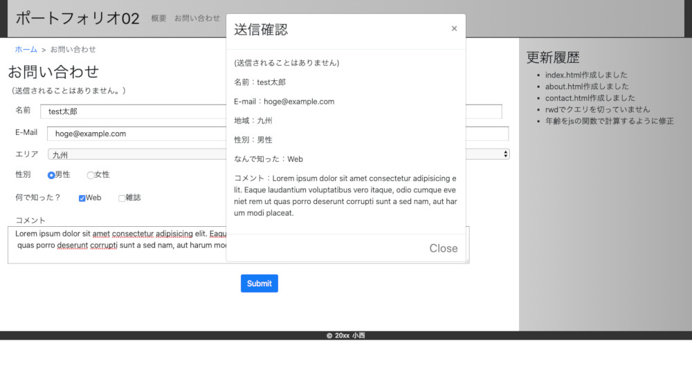

# ポートフォリオ02

## URL
[https://takayuki-k.github.io/sample/02/](https://takayuki-k.github.io/sample/02/)  
  


## 説明
html/css/jQueryのポートフォリオです。  
「お問い合わせ」のページはjQueryで書いています。  
画像圧縮で表示速度が劇的に速くなったので、画像圧縮は大事だなと実感しました…  

style.cssでmedia queryを使用してrwdに対応しているのではなく、  
Bootstrapのmedia queryを使用してrwdにしているのも特徴です。  

つまり、自分でmedia queryは書いていないということです。  

PWAテスト中  
ホーム画面に追加の通知がこないのが問題です。  
キャッシュはしている模様です（機内モードでも表示できます）  

### 2019/10/16  
google APIの設定ミスにより、オフライン表示もできなくなりました...  

### 2019/12/02  
cacheの保存可能、アンドロイドでホーム画面に追加に通知確認。  
アンドロイド,PC-Chromeで機内モードは可能になりました。  

また、  
```
A cookie associated with a cross-site resource at http://www.cloudflare.com/ was set without the `SameSite` attribute. A future release of Chrome will only deliver cookies with cross-site requests if they are set with `SameSite=None` and `Secure`. You can review cookies in developer tools under Application>Storage>Cookies and see more details at https://www.chromestatus.com/feature/5088147346030592 and https://www.chromestatus.com/feature/5633521622188032.
```
のメッセージが出現(Chrome使用)  

### 2019/12/08  
PC-Chromeで機内モードが不可能に（）  
上記`SameSite=None`はcloudflare.comが既知のエラーとして発表したようです。  

機内モードで、ページの表示確認ができています。(Chrome)  

### 2020/05/06  
概要ページの年齢計算を、js関数で自動計算するように修正しました。  
また、CDNの記述方式を  
`//github.com/~`  から  ``https://github.com/~``  
に変更しました。  


  

  

  

  
